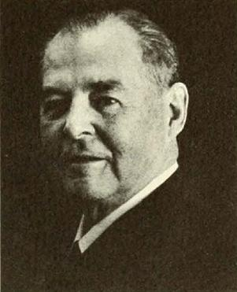
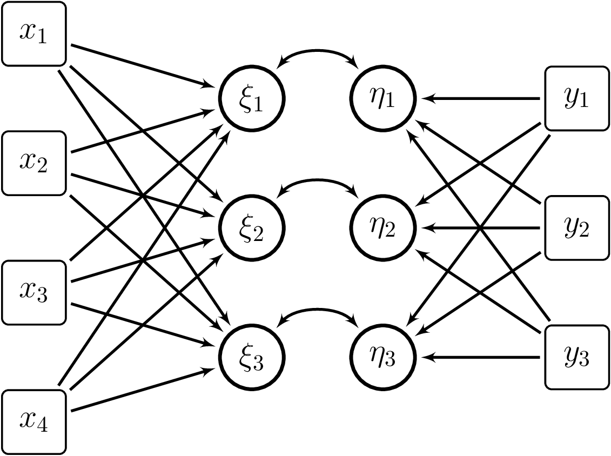

# Analiza kanoniczna

Analiza kanoniczna (ang. *Canonical Correlation Analysis, CCA*) jest klasyczną techniką statystyczną służącą do badania związków pomiędzy dwoma zestawami zmiennych wielowymiarowych. Jej podstawowym celem jest znalezienie takich kombinacji liniowych zmiennych z obu zestawów, które maksymalizują wzajemną korelację – są to tzw. kanoniczne zmienne lub kanoniczne składniki. Technika ta została wprowadzona przez Harolda Hotellinga w roku 1936, a więc w okresie intensywnego rozwoju metod statystycznych opartych na algebrze macierzy [@hotelling1936].

::: column-margin

:::

W tym samym czasie powstawały także inne fundamenty analizy wielowymiarowej, takie jak analiza składowych głównych (PCA) czy dyskryminacja liniowa (LDA)[^cca-1]. Analiza kanoniczna stanowi zatem jeden z filarów klasycznej statystyki wielowymiarowej i do dziś pozostaje istotnym narzędziem eksploracji i modelowania złożonych zależności.

[^cca-1]: o których już wkrótce

W odróżnieniu od regresji wielorakiej, która przewiduje zestaw zmiennych zależnych na podstawie zestawu predyktorów, analiza kanoniczna traktuje obie grupy zmiennych symetrycznie – nie zakłada istnienia wyraźnego kierunku przyczynowego. Dlatego stosuje się ją w sytuacjach, gdy celem jest ogólna analiza współzależności pomiędzy dwoma zbiorami zmiennych, a nie przewidywanie jednego zestawu na podstawie drugiego.

{width="500"}

Typowe zastosowania analizy kanonicznej obejmują:

-   Psychologia i nauki społeczne – badanie relacji między grupami testów poznawczych a zmiennymi demograficznymi.

    *Przykład:* W badaniu dzieci w wieku szkolnym mierzy się wyniki w testach: pamięci, uwagi i szybkości przetwarzania informacji (zmienne poznawcze), a następnie porównuje się je z takimi cechami, jak wiek, poziom wykształcenia rodziców oraz status społeczno-ekonomiczny (zmienne demograficzne). Analiza kanoniczna pozwala ocenić, które kombinacje cech demograficznych są powiązane z ogólnym wzorcem zdolności poznawczych.,

-   Biologia i medycyna – analiza zależności pomiędzy pomiarami fizjologicznymi (np. poziomy hormonów) a cechami klinicznymi (np. objawy choroby).

    *Przykład:* W grupie pacjentów z depresją mierzy się poziomy kortyzolu, serotoniny i dopaminy (wskaźniki biologiczne), a także nasilenie objawów takich jak bezsenność, brak apetytu, spadek energii czy anhedonia[^cca-2] (zmienne kliniczne). Analiza kanoniczna pomaga zidentyfikować wspólną strukturę zmienności – np. czy określony wzorzec hormonalny odpowiada za określony profil objawów.

-   Ekonomia – porównywanie zestawów wskaźników ekonomicznych z różnych dziedzin (np. zmienne finansowe vs. konsumpcyjne).

    *Przykład:* W badaniu krajów Unii Europejskiej zestawia się wskaźniki makroekonomiczne, takie jak stopa inflacji, stopa bezrobocia i zadłużenie publiczne (zmienne finansowe), z danymi dotyczącymi konsumpcji – np. wydatki na kulturę, transport i żywność (zmienne konsumpcyjne). Analiza kanoniczna umożliwia odkrycie wspólnych układów zależności między stabilnością finansową a wzorcami konsumpcji.

-   Lingwistyka korpusowa – badania zbieżności struktur gramatycznych i semantycznych.

    *Przykład:* W analizie dużego korpusu tekstów (np. esejów studentów lub wypowiedzi polityków) zestawia się cechy składniowe, takie jak długość zdań, liczba zdań podrzędnie złożonych, liczba czasowników (zmienne składniowe), z cechami semantycznymi takimi jak stopień abstrakcyjności używanych rzeczowników, nacechowanie emocjonalne słownictwa czy liczba metafor (zmienne semantyczne). CCA pozwala ocenić, czy bardziej złożona składnia idzie w parze z większą abstrakcyjnością przekazu.

-   Genomika i bioinformatyka – integracja danych z różnych platform pomiarowych (np. ekspresji genów i metylacji DNA[^cca-3]).

    *Przykład:* Dla próbek guza nowotworowego analizuje się jednocześnie poziomy ekspresji genów (np. z RNA) i poziomy metylacji DNA (z mikromacierzy EPIC). CCA pozwala odnaleźć kanoniczne kombinacje genów i regionów metylacyjnych, które są współzmienne i mogą być związane z podtypem nowotworu lub odpowiedzią na leczenie.

[^cca-2]: termin stosowany w psychologii i psychiatrii, który oznacza utraconą zdolność do odczuwania przyjemności z czynności, które wcześniej były źródłem satysfakcji, radości lub zainteresowania

[^cca-3]: polega na chemicznym dołączaniu grupy metylowej (–CH~3~)

# Przypomnienie z algebry 😉

Na potrzeby definicji modeli kanonicznego potrzebne będą nam pewne twierdzenia z zakresu algebry.

::: {#lem-1 .lem}
## Nierówność **Cauchy'ego–Schwarza**[^cca-4]

Niech $a,b$ będą dwoma wektorami kolumnowymi o wymiarach $p\times 1$, wówczas

$$
(a^\top b)^2 \leq (a^\top a)(b^\top b).
$$

Powyższa nierówność staje się równością jeśli $b=\lambda \cdot a$, dla pewnej stałej $\lambda$.
:::

[^cca-4]: znanej również jako Cauchy’ego–Buniakowskiego–Schwarza–Bienaymé

::: {#lem-2 .lem}
## Twierdzenie o maksymalizacji formy kwadratowej[^cca-5]

Niech $\mathbf{B} \in \mathbb{R}^{p \times p}$ będzie symetryczną, dodatnio określoną macierzą, o uporządkowanych malejąco wartościach własnych $\lambda_1 \geq \lambda_2 \geq \cdots \geq \lambda_p > 0$ oraz odpowiadających im ortonormalnych wektorach własnych $\boldsymbol{e}_1, \boldsymbol{e}_2, \ldots, \boldsymbol{e}_p$. Wówczas:

1.  **Maksymalna wartość ilorazu Rayleigha** dla wszystkich niezerowych wektorów $\boldsymbol{x} \in \mathbb{R}^p$: $$
    \max_{\boldsymbol{x} \neq \boldsymbol{0}} \frac{\boldsymbol{x}^\top \mathbf{B} \boldsymbol{x}}{\boldsymbol{x}^\top \boldsymbol{x}} = \lambda_1,
    $$ i jest osiągana dla $\boldsymbol{x} = \boldsymbol{e}_1$, czyli wektora własnego odpowiadającego największej wartości własnej.

2.  **Minimalna wartość ilorazu Rayleigha**:

$$
\min_{\boldsymbol{x} \neq \boldsymbol{0}} \frac{\boldsymbol{x}^\top \mathbf{B} \boldsymbol{x}}{\boldsymbol{x}^\top \boldsymbol{x}} = \lambda_p,
$$ i jest osiągana dla $\boldsymbol{x} = \boldsymbol{e}_p$, czyli wektora własnego odpowiadającego najmniejszej wartości własnej.

3.  **Ograniczona maksymalizacja w podprzestrzeni ortogonalnej do** $\boldsymbol{e}_1, \ldots, \boldsymbol{e}_k$:

Jeśli maksymalizacja jest prowadzona pod warunkiem ortogonalności $\boldsymbol{x} \perp \boldsymbol{e}_1, \ldots, \boldsymbol{e}_k$, wówczas: $$
\max_{\boldsymbol{x} \perp \boldsymbol{e}_1, \ldots, \boldsymbol{e}_k} \frac{\boldsymbol{x}^\top \mathbf{B} \boldsymbol{x}}{\boldsymbol{x}^\top \boldsymbol{x}} = \lambda_{k+1},
$$ i maksimum osiągane jest dla $\boldsymbol{x} = \boldsymbol{e}_{k+1}$.

Twierdzenie to formalizuje intuicję, że **wartości własne** macierzy symetrycznej reprezentują **ekstremalne wartości formy kwadratowej** w kierunkach określonych przez wektory własne.
:::

[^cca-5]: znane również jako lemat Rayleigha-Ritza

Oto **matematyczna definicja modelu CCA** oraz **dowód istnienia rozwiązania**:

# Definicja modelu

Niech $$
\begin{pmatrix}
X\\
Y
\end{pmatrix}
\sim
\mathcal{N}_{p+q}\left(
\begin{pmatrix}
\mu \\
\nu
\end{pmatrix},
\begin{pmatrix}
\Sigma_{XX} & \Sigma_{XY}\\
\Sigma_{YX} & \Sigma_{YY}
\end{pmatrix}
\right)
$$ {#eq-normal}

gdzie:

-   $X \in \mathbb{R}^{q}$ i $Y \in \mathbb{R}^{p}$,
-   $\Sigma_{XX}$ i $\Sigma_{YY}$ to macierze kowariancji odpowiednio $q \times q$ i $p \times p$,
-   $\Sigma_{XY}=\Sigma_{YX}^\top$ to macierz kowariancji między $X$ i $Y$.

Szukamy wektorów $a \in \mathbb{R}^q$, $b \in \mathbb{R}^p$, które **maksymalizują korelację** pomiędzy kombinacjami liniowymi $$
U=a^\top X, \quad V=b^\top Y,
$$ czyli $$
\rho(a,b)=\frac{a^\top \Sigma_{XY}b}{\sqrt{a^\top \Sigma_{XX}a},\sqrt{b^\top \Sigma_{YY}b}}.
$$

Pierwsza para kanoniczna $(a_1,b_1)$ to para rozwiązująca ten problem maksymalizacji. Kolejne pary $(a_k,b_k)$ definiuje się analogicznie, przy dodatkowych warunkach ortogonalności względem wcześniejszych par.

# Dowód istnienia rozwiązania

## Sformułowanie problemu własnego

Przekształćmy zmienne $$
c=\Sigma_{XX}^{1/2}a,\quad d=\Sigma_{YY}^{1/2}b.
$$

Wówczas $$
\rho(a,b)=\frac{c^\top\Sigma_{XX}^{-1/2}\Sigma_{XY}\Sigma_{YY}^{-1/2}d}{\sqrt{c^\top c}\sqrt{d^\top d}}.
$$

Z lematu Cauchy’ego–Buniakowskiego–Schwarza mamy $$
\left|c^\top \mathbf{M} d\right| \le
\bigl(c^\top \mathbf{M}\mathbf{M}^\top c\bigr)^{1/2}\bigl(d^\top d\bigr)^{1/2},
\quad \text{gdzie }\mathbf{M}=\Sigma_{XX}^{-1/2}\Sigma_{XY}\Sigma_{YY}^{-1/2}.
$$ {#eq-cbs}

Zatem $$
\rho(a,b)^2 \le
\frac{c^\top\mathbf{M}\mathbf{M}^\top c}{c^\top c}.
$$ {#eq-cbs2}

Ponieważ $\mathbf{M}\mathbf{M}^\top=\Sigma_{XX}^{-1/2}\Sigma_{XY}\Sigma_{YY}^{-1}\Sigma_{YX}\Sigma_{XX}^{-1/2}$ jest macierzą symetryczną dodatnio określoną, z lematu Rayleigha–Ritza otrzymujemy $$
\max_{c\neq 0}\frac{c^\top\mathbf{M}\mathbf{M}^\top c}{c^\top c}=\lambda_1,
$$ gdzie $\lambda_1$ to największa wartość własna tej macierzy, osiągana dla $c=e_1$ – jej wektora własnego.

Jeśli $$
d \propto \Sigma_{YY}^{-1/2}\Sigma_{YX}\Sigma_{XX}^{-1/2}e_1
$$ to @eq-cbs oraz @eq-cbs2 staje się równością.

Wracając do oryginalnych współczynników $$
a_1=\Sigma_{XX}^{-1/2}e_1,\quad
b_1\propto \Sigma_{YY}^{-1/2}\Sigma_{YX}\Sigma_{XX}^{-1/2}e_1.
$$

Pierwsza korelacja kanoniczna wynosi wówczas $$
\rho_1=\sqrt{\lambda_1}.
$$

Analogicznie dla kolejnych par, przy założeniu $c\perp e_1,\dots,e_{k-1}$, mamy $$
\rho_k=\sqrt{\lambda_k},
$$ gdzie $\lambda_k$ to kolejne wartości własne macierzy $\Sigma_{XX}^{-1/2}\Sigma_{XY}\Sigma_{YY}^{-1}\Sigma_{YX}\Sigma_{XX}^{-1/2}$, a odpowiadające im wektory własne $e_k$ definiują kolejne wektory kanoniczne $$
U_k=e_k^\top\Sigma_{XX}^{-1/2}X,\quad
V_k=f_k^\top\Sigma_{YY}^{-1/2}Y,\quad
f_k\propto \Sigma_{YY}^{-1/2}\Sigma_{YX}\Sigma_{XX}^{-1/2}e_k.
$$

## Własności rozwiązań

Dla każdej pary $(U_k,V_k)$ zachodzi $$
\mathrm{Var}(U_k)=\mathrm{Var}(V_k)=1,\quad
\mathrm{Cov}(U_k,U_l)=\mathrm{Cov}(V_k,V_l)=\mathrm{Cov}(U_k,V_l)=0\quad (k\neq l).
$$

::: callout-note
### Dowód powyższych równości

Dla danej pary wektorów kanonicznych mamy

$$
U_k = a_k^\top X = e_k^\top \Sigma_{XX}^{-1/2} X,
    \qquad
    V_k = b_k^\top Y = f_k^\top \Sigma_{YY}^{-1/2} Y,
$$ gdzie:

-   $e_k$ jest ortonormalnym[^cca-6] wektorem własnym macierzy $\Sigma_{XX}^{-1/2} \Sigma_{XY} \Sigma_{YY}^{-1} \Sigma_{YX} \Sigma_{XX}^{-1/2}$
-   $f_k \propto \Sigma_{YY}^{-1/2} \Sigma_{YX} \Sigma_{XX}^{-1/2} e_k$,
-   $\rho_k = \sqrt{\lambda_k}$, gdzie $\lambda_k$ to odpowiadająca wartość własna.

Macierze $\Sigma_{XX}$, $\Sigma_{YY}$ są dodatnio określone, więc można wprowadzić transformacje $$
\tilde{X} = \Sigma_{XX}^{-1/2}X, \quad \tilde{Y} = \Sigma_{YY}^{-1/2}Y.
$$ Zatem $$
U_k = e_k^\top \tilde{X},\quad V_k = f_k^\top \tilde{Y}.
$$

Najpierw udowodnimy, że $\operatorname{Var}(U_k) = \operatorname{Var}(V_k) = 1$.

Zmienna $U_k = e_k^\top \tilde{X}$, więc $$
\operatorname{Var}(U_k) = \operatorname{Var}(e_k^\top \tilde{X}) = e_k^\top \operatorname{Var}(\tilde{X}) e_k.
$$ Zauważmy, że $$
\operatorname{Var}(\tilde{X}) = \Sigma_{XX}^{-1/2} \Sigma_{XX} \Sigma_{XX}^{-1/2} = I,
$$ więc $$
\operatorname{Var}(U_k) = e_k^\top I e_k = e_k^\top e_k = 1.
$$ Analogicznie $$
\operatorname{Var}(V_k) = f_k^\top \operatorname{Var}(\tilde{Y}) f_k = f_k^\top f_k = 1,
$$ ponieważ $\tilde{Y}$ ma jednostkową macierz kowariancji, a $f_k$ są znormalizowane.

Teraz dowiedziemy, że $\operatorname{Cov}(U_k, U_l) = 0$ dla $k \neq l$

$$
\operatorname{Cov}(U_k, U_l) = \operatorname{Cov}(e_k^\top \tilde{X}, e_l^\top \tilde{X}) = e_k^\top \operatorname{Var}(\tilde{X}) e_l = e_k^\top e_l.
$$ Ponieważ $e_k$, $e_l$ są ortonormalnymi wektorami własnymi symetrycznej macierzy, to $$
e_k^\top e_l = 0 \quad \text{dla } k \neq l.
$$ Zatem $$
\operatorname{Cov}(U_k, U_l) = 0.
$$ Podobnie $$
\operatorname{Cov}(V_k, V_l) = f_k^\top f_l = 0 \quad \text{dla } k \neq l.
$$

Na koniec dowiedźmy, że $\operatorname{Cov}(U_k, V_l) = 0$ dla $k \neq l$ $$
\operatorname{Cov}(U_k, V_l) = \operatorname{Cov}(e_k^\top \tilde{X}, f_l^\top \tilde{Y}) = e_k^\top \operatorname{Cov}(\tilde{X}, \tilde{Y}) f_l.
$$ Z definicji $$
\operatorname{Cov}(\tilde{X}, \tilde{Y}) = \Sigma_{XX}^{-1/2} \Sigma_{XY} \Sigma_{YY}^{-1/2} =: M.
$$ Zatem $$
\operatorname{Cov}(U_k, V_l) = e_k^\top M f_l.
$$ Z poprzednich wyprowadzeń $$
f_l \propto M^\top e_l.
$$ Zatem $$
\operatorname{Cov}(U_k, V_l) \propto e_k^\top M M^\top e_l.
$$ Ale macierz $MM^\top$ jest symetryczna, a $e_k$ są jej ortonormalnymi wektorami własnymi, więc $$
e_k^\top MM^\top e_l = 0 \quad \text{dla } k \neq l.
$$ Zatem $$
\operatorname{Cov}(U_k, V_l) = 0.
$$
:::

[^cca-6]: ortonormalność wynika z niezmienniczości korelacji względem długości wektorów

Ponadto korelacje kanoniczne są niezmiennicze względem odwracalnych przekształceń liniowych $X$ i $Y$: $$
X^*=\mathcal{U}^TX+u,\quad Y^*=\mathcal{V}^TY+v \implies
\rho_i(X^*,Y^*)=\rho_i(X,Y).
$$

# Testowanie liczby istotnych korelacji kanonicznych

W kontekście analizy kanonicznej (CCA), istotnym zagadnieniem jest testowanie liczby istotnych korelacji kanonicznych. Celem jest ustalenie, ile par zmiennych kanonicznych (kombinacji liniowych zmiennych z dwóch zbiorów $X$ i $Y$) jest statystycznie istotnie skorelowanych. W tym celu stosuje się testy statystyczne, które pozwalają odrzucić hipotezę zerową o braku skorelowania między zbiorami zmiennych.

## Hipoteza zerowa i alternatywna

Dla zbiorów zmiennych $X \in \mathbb{R}^p$, $Y \in \mathbb{R}^q$, testujemy

-   $H_0: \rho_1 = \rho_2 = \cdots = \rho_s = 0$ – brak istotnych korelacji kanonicznych (pierwiastków),
-   $H_1$: istnieje co najmniej jedna istotna korelacja kanoniczna, tj. $\exists i \leq s \ \text{takie, że } \rho_i \ne 0$.

gdzie $s = \min(p, q)$, a $\rho_i$ to $i$-ta korelacja kanoniczna.

## Statystyka testowa – test Wilka

W celu przetestowania tej hipotezy, wykorzystuje się statystykę Wilka, która bazuje na iloczynie składników postaci ($1 - \lambda_i$), gdzie $\lambda_i$ to wartości własne odpowiadające kwadratom korelacji kanonicznych $$
\lambda_i = \rho_i^2.
$$ Statystyka Wilka jest zdefiniowana jako $$
\Lambda = \prod_{i=1}^s (1 - \lambda_i).
$$

Interpretacja - im mniejsze wartości $\Lambda$, tym większa zależność między zbiorami $X$ i $Y$. Duże wartości $\lambda_i$ (czyli silne korelacje kanoniczne) powodują, że $\Lambda$ dąży do zera.

W praktyce, dla próby $n$-elementowej, stosujemy wersję testu bazującą na macierzach kowariancji estymowanych z próby $S_{XX}, S_{XY}, S_{YX}, S_{YY})$ – odpowiedniki $\Sigma_{XX}, \Sigma_{XY}, \Sigma_{YX}, \Sigma_{YY}$.

Wówczas $$
T^2/n = \left|I - S_{YY}^{-1} S_{YX} S_{XX}^{-1} S_{XY} \right| = \prod_{i=1}^s (1 - \hat{\lambda}_i),
$$ gdzie $\hat{\lambda}_i$ to *próbkowe wartości własne* (szacunki $\lambda_i$).

## Rozkład asymptotyczny i transformacja do rozkładu $\chi^2$

Wielu autorów (np. @marriott1986) sugeruje przekształcenie statystyki Wilksa do postaci asymptotycznie zgodnej z rozkładem $\chi^2$, np. za pomocą transformacji

$$
-\left(n - \frac{1}{2}(p + q + 1) \right) \cdot \ln(\Lambda) \sim \chi^2_{pq}.
$$

## Procedura testowania

1.  Oszacuj wszystkie korelacje kanoniczne $\hat{\rho}_1, \ldots, \hat{\rho}_p$.
2.  Od $k = 0$ do $p-1$ oblicz $\Lambda_k = \prod_{i=k+1}^{p}(1 - \hat{\rho}_i^2)$.
3.  Oblicz transformację $\chi^2_k=-\left(n - \frac{1}{2}(p + q + 1) \right) \cdot \ln(\Lambda_k)$
4.  Porównaj z odpowiednim kwantylem rozkładu $\chi^2$ z $(q - k)(r - k)$ stopniami swobody.
5.  Jeśli wartość statystyki przekracza ten kwantyl ($p<\alpha$), odrzuć $H_0^{(k)}$ i przejdź do $k+1$. Jeśli nie, zatrzymaj się – kolejne korelacje uznajemy za nieistotne.

Ocena dopasowania modelu w analizie kanonicznej (CCA – *Canonical Correlation Analysis*) obejmuje kilka istotnych wskaźników diagnostycznych, które pozwalają zrozumieć siłę i strukturę relacji między dwoma zbiorami zmiennych. Poniżej omówione zostały trzy kluczowe miary: ładunki czynnikowe, wariancja wyjaśniona oraz redundancja.

# Ocena dopasowania modelu

## Ładunki czynnikowe (ang. *canonical loadings*)

-   **Definicja** - korelacje pomiędzy zmiennymi kanonicznymi (czyli kombinacjami liniowymi wektorów $a_k'X$ i $b_k'Y$) a oryginalnymi zmiennymi ze zbiorów $X$ i $Y$.
-   **Interpretacja**:
    -   Pokazują, które konkretne zmienne pierwotne w największym stopniu „ładują się” (czyli kontrybuują) na daną zmienną kanoniczną.
    -   Wysoka wartość (np. \> 0.7) wskazuje na silną zależność między zmienną oryginalną a daną zmienną kanoniczną.
    -   Znaki dodatnie/ujemne pozwalają wnioskować o kierunku związku.
-   **Wzór**:
    -   Dla zbioru $X$: $$
        \text{loadings}_X = \mathrm{Corr}(X, U_k) = \Sigma_{XX} a_k
        $$
    -   Dla zbioru $Y$: $$
        \text{loadings}_Y = \mathrm{Corr}(Y, V_k) = \Sigma_{YY} b_k
        $$

## Wariancja wyjaśniona (ang. *variance explained*)

-   **Definicja** - średnia kwadratów ładunków czynnikowych dla każdej zmiennej kanonicznej i każdego zbioru danych.
-   **Interpretacja**:
    -   Informuje, jaką część wariancji oryginalnych zmiennych w danym zbiorze ($X$ lub $Y$) wyjaśnia dana zmienna kanoniczna.
    -   Można traktować ten wskaźnik jako odpowiednik współczynnika determinacji $R^2$ dla pojedynczej zmiennej kanonicznej.
    -   Wysoka wartość oznacza, że dana zmienna kanoniczna dobrze reprezentuje zbiór, z którego została utworzona.
-   **Wzór**: $$
    \text{Explained variance} = \frac{1}{p} \sum_{j=1}^{p} \mathrm{Corr}^2(X_j, U_k)
    $$ gdzie $p$ to liczba zmiennych w zbiorze $X$, a $U_k$ to $k$-ta zmienna kanoniczna.

## Redundancja (ang. *redundancy index*)

-   **Definicja** - iloczyn kwadratu korelacji kanonicznej $\rho_k^2$ oraz wariancji wyjaśnionej przez daną zmienną kanoniczną we własnym zbiorze.
-   **Interpretacja**:
    -   Informuje, jaka część przeciętnej wariancji jednej grupy zmiennych jest wyjaśniana przez zmienną kanoniczną utworzoną na podstawie drugiego zbioru.
    -   Miara ta pokazuje, czy dany zbiór zmiennych wnosi unikalną informację o drugim zbiorze.
    -   Wysoka redundancja oznacza, że istnieje istotny związek między strukturami dwóch zbiorów zmiennych.
-   **Wzór**: $$
    \text{Redundancy}_X = \rho_k^2 \cdot \left( \frac{1}{p} \sum_{j=1}^{p} \mathrm{Corr}^2(X_j, U_k) \right)
    $$ Analogicznie definiujemy redundancję względem $Y$.

| Miara | Co opisuje | Interpretacja praktyczna |
|-------------------|----------------------------|-------------------------|
| Ładunki czynnikowe | Siłę powiązania zmiennej oryginalnej z kanoniczną | Wysoka wartość ⇒ silna reprezentacja zmiennej |
| Wariancja wyjaśniona | Średnia siła reprezentacji zbioru przez zm. kanoniczną | Miara dopasowania struktury do zbioru |
| Redundancja | Ilość informacji o jednym zbiorze zawarta w drugim | Miara istotności relacji między zbiorami |

# Założenia stosowalności analizy kanonicznej

## Normalność wielowymiarowa

Zakłada się, że obydwa zbiory zmiennych losowych – $X$ i $Y$ – są wspólnie rozkładem normalnym wielowymiarowym jak podano w @eq-normal. Normalność umożliwia stosowanie testów statystycznych (np. testu Wilksa) do oceny liczby istotnych korelacji kanonicznych.

## Brak wartości odstających (outliers)

Zarówno obserwacje odstające jednowymiarowe, jak i wielowymiarowe mogą istotnie zaburzać wynik analizy kanonicznej. Odstające wartości mogą wpływać na macierze kowariancji, zmieniając kierunki i siły relacji między zbiorami zmiennych.

## Wystarczająca liczba obserwacji

Liczba obserwacji powinna znacząco przekraczać liczbę zmiennych w każdym zbiorze. Liczba obserwacji $n$ w każdej grupie powinna być większa niż suma liczby zmiennych w $X$ i $Y$ $$
n > p + q
$$ Zapewnia odwracalność macierzy kowariancji oraz stabilność estymatorów.

## Liniowość zależności

Zakłada się, że związki między wszystkimi parami zmiennych są liniowe. Ponieważ CCA opiera się na maksymalizacji liniowych kombinacji, nieliniowe zależności mogą pozostać niewykryte.

## Brak nadmiernej współliniowości (multikolinearności)

Zmienne wewnątrz każdego zbioru (w $X$ lub w $Y$) nie powinny być nadmiernie skorelowane. Wysoka współliniowość może prowadzić do niestabilnych i trudnych do interpretacji wektorów kanonicznych.

## Niezależność obserwacji

Każda obserwacja powinna pochodzić od innej jednostki (brak powtórzeń pomiarów). Niezależność warunkuje poprawność estymatorów kowariancji.

# Implementacje CCA w R

Istnieje wiele bibliotek w języku R umożliwiających wykonanie analizy kanonicznej. Wśród najbardziej znanych są: `CCA::cc()`, `stats::cancor()`), `yacca::cca()` oraz w wersji regularyzowanej `mixOmics::rcc()`.

::: exm-1
Oszacujemy związek między dwoma zestawami zmiennych w zbiorze `mtcars` przy użyciu funkcji `cca()` z pakietu `yacca`.

Zbiór `X` – zmienne związane z konstrukcją silnika i układem napędowym:

-   `cyl` – liczba cylindrów,
-   `disp` – pojemność skokowa silnika,
-   `hp` – moc silnika,
-   `drat` – przełożenie tylnego mostu,
-   `vs` – układ cylindrów.

Zbiór `Y` – zmienne związane z osiągami i eksploatacją:

-   `mpg` – zużycie paliwa,
-   `qsec` – czas przyspieszenia na odcinku 1/4 mili,
-   `wt` – masa pojazdu,
-   `gear` – liczba biegów,
-   `am` – typ skrzyni biegów (0 = automatyczna, 1 = manualna).

```{r}
library(yacca)

X <- mtcars[, c("cyl", "disp", "hp", "drat", "vs")]
Y <- mtcars[, c("mpg", "qsec", "wt", "gear", "am")]

model <- cca(X, Y, xcenter = T, ycenter = T, xscale = T, yscale = T)
summary(model)
```

Teraz przeanalizujemy wyniki modelu. Zaczniemy od korelacji kanonicznych, które można wywołać za pomocą `model$corr`.

Wyniki analizy kanonicznej wskazują, że pierwsza zmienna kanoniczna (`CV 1`) charakteryzuje się bardzo wysoką korelacją kanoniczną, równą 0.967. Oznacza to, że istnieje silny związek liniowy pomiędzy odpowiednimi kombinacjami liniowymi zmiennych ze zbiorów $X$ i $Y$. Dodatkowo, wartość wspólnej wariancji dla tej zmiennej wynosi 93.4%, co oznacza, że ta pierwsza para zmiennych kanonicznych wyjaśnia znaczną część współzależności między oboma zestawami zmiennych. Druga zmienna kanoniczna (`CV 2`) również wykazuje silną korelację, równą 0.853, co sugeruje istnienie kolejnego istotnego związku między pozostałymi informacjami zawartymi w zbiorach $X$ i $Y$. Wspólna wariancja dla tej pary wynosi 72.7%, co wciąż stanowi wysoki poziom wyjaśnienia współzmienności.

Kolejne zmienne kanoniczne (`CV 3, CV 4, CV 5`) wykazują już znacznie słabsze korelacje kanoniczne – odpowiednio 0.495, 0.388 i 0.115. Oznacza to, że siła zależności między dalszymi kombinacjami liniowymi zmiennych $X$ i $Y$ jest wyraźnie mniejsza. Co więcej, wspólna wariancja spada (`model$corrsq`) dla tych par odpowiednio do 24.5%, 15.1% i jedynie 1.3%. Te wartości sugerują, że trzecia i kolejne zmienne kanoniczne mogą mieć ograniczoną wartość interpretacyjną i potencjalnie można je pominąć w interpretacji, szczególnie jeśli wyniki testów istotności (np. test Bartletta) nie potwierdzają ich znaczenia.

Wyniki testu chi-kwadrat Bartletta pozwalają ocenić, które pary zmiennych kanonicznych są statystycznie istotne, tzn. które z nich wyjaśniają istotną część współzmienności między dwoma zbiorami zmiennych.

-   Pierwsza kanoniczna korelacja (`CV 1`) jest wysoce istotna statystycznie, co potwierdza bardzo niski poziom istotności $p < 2.3 \times 10^{-13}$. To oznacza, że pierwsza para zmiennych kanonicznych wyjaśnia istotną część zależności pomiędzy zbiorami $X$ i $Y$.
-   Druga kanoniczna korelacja (`CV 2`) również jest istotna, choć nie tak silnie jak pierwsza. Wartość statystyki wynosi 44.81 przy 16 stopniach swobody, a poziom istotności to około $p = 0.00015$, co także pozwala na odrzucenie hipotezy zerowej o braku korelacji na tym poziomie.
-   Trzecia (`CV 3`), czwarta (`CV 4`) i piąta (`CV 5`) korelacje kanoniczne nie są istotne statystycznie. Ich wartości $p$-value przekraczają standardowe poziomy istotności (0.05), co oznacza brak wystarczających dowodów na to, że odpowiadające im kombinacje zmiennych $X$ i $Y$ są skorelowane w populacji.

Na podstawie testu Bartletta można stwierdzić, że tylko pierwsze dwie kanoniczne pary zmiennych $(U_1, V_1)$ i $(U_2, V_2)$ są istotne statystycznie. Kolejne pary nie wnoszą istotnej informacji o zależności między zbiorami zmiennych i można je pominąć w interpretacji oraz dalszej analizie. Taki wniosek jest zgodny z wcześniejszą oceną siły korelacji kanonicznych oraz wspólnej wariancji.

Interpretacja wag kanonicznych (*canonical variate coefficients* - `model$xcoef` i `model$ycoef`) oraz ładunków strukturalnych (*structural correlations*, inaczej *loadings* - `model$xstructcorr` i `model$ystructcorr`) pozwala na pełne zrozumienie, które zmienne pierwotne mają największy wpływ na poszczególne zmienne kanoniczne oraz jak mocno są z nimi skorelowane. W interpretacji należy analizować oba zestawy danych równocześnie – zarówno dla zmiennych $X$, jak i $Y$.

`CV 1`

-   Dla zmiennych $X$, największy wpływ mają: `disp` (–0.44), `cyl` (–0.35), `hp` (–0.10) – czyli im większa pojemność i liczba cylindrów, tym niższa wartość zmiennej kanonicznej $U_1$.
-   Dla zmiennych $Y$, najistotniejsze są: `wt` (–0.56), `qsec` (0.56), `gear` (0.20) – wskazuje to, że $V_1$ rośnie wraz z `qsec` i `gear`, a maleje przy wzroście `wt`.

Jednocześnie ładunki strukturalne pokazują, jak silnie poszczególne zmienne oryginalne są skorelowane z daną zmienną kanoniczną:

-   Dla $X$: `cyl` (–0.98), `disp` (–0.97), `hp` (–0.86), `vs` (0.83) – bardzo silne powiązania ze zmiennymi opisującymi silnik.
-   Dla $Y$: `mpg` (0.90), `wt` (–0.87), `qsec` (0.60) – sugeruje, że pierwsza zmienna kanoniczna opisuje związek między cechami silnika a zużyciem paliwa i masą pojazdu.

`CV 1` wskazuje na silną zależność między masą i mocą samochodu (cechy techniczne) a jego ekonomią (`mpg`) i osiągami (`qsec`). Większe silniki są związane z większą masą i spalaniem (niższym `mpg`).

`CV 2`

-   Dla $X$: `disp` (–0.90), `hp` (1.06), `drat` (0.41), `vs` (–0.67) – wskazuje na kontrast między mocą (`hp`) a objętością i układem silnika (`vs`).
-   Dla $Y$: `gear` (0.52), `am` (0.27) – wartości `CV 2` rosną przy wyższej liczbie biegów i skrzyni manualnej.

Jednocześnie ładunki strukturalne pokazują, że

-   $X$: `drat` (0.50), `hp` (0.38), `vs` (–0.36) – umiarkowane korelacje.
-   $Y$: `gear` (0.79), `am` (0.73), `qsec` (–0.74) – pokazuje powiązanie ze skrzynią biegów i czasem przyspieszenia.

`CV 2` odzwierciedla typ skrzyni biegów i dynamikę pojazdu. Samochody z większą liczbą biegów i skrzynią manualną mają inne cechy napędu niż te z automatem[^cca-7].

Interpretację pozostałych par kanonicznych pominięto, ze wzgledu na brak istotności statystycznej.

Interpretacja adekwatności zmiennych kanonicznych (ang. *Canonical Variate Adequacies*) polega na ocenie, w jakim stopniu każda z kanonicznych zmiennych $U_k$ i $V_k$ wyjaśnia wariancję oryginalnych zmiennych w swoim zbiorze (odpowiednio: $X$ lub $Y$). Wskaźniki te są interpretowane jako miara „reprezentatywności” danej zmiennej kanonicznej względem zmiennych pierwotnych.

`CV 1`

Dla zbioru $X$, pierwsza zmienna kanoniczna $U_1$ wyjaśnia 76,2% całkowitej wariancji zmiennych pierwotnych. Oznacza to, że kombinacja liniowa $U_1$ bardzo dobrze reprezentuje główny wymiar zróżnicowania zmiennych $X$ (np. liczby cylindrów, pojemności silnika, mocy itd.). Wysoka adekwatność wskazuje, że $U_1$ zawiera większość informacji zawartej w zmiennych $X$. Dla zbioru $Y$, odpowiadająca zmienna kanoniczna $V_1$ wyjaśnia 49,4% wariancji zmiennych pierwotnych. Jest to również stosunkowo wysoka wartość, co oznacza, że $V_1$ dobrze streszcza informacje ze zbioru $Y$ (`mpg`, `qsec`, `wt`, `gear`, `am`). Zatem pierwsza para zmiennych kanonicznych $(U_1, V_1)$ nie tylko ma bardzo wysoką korelację wzajemną, ale również silnie reprezentuje oba zbiory zmiennych, co czyni ją interpretacyjnie bardzo istotną.

`CV 2`

Dla zbioru $X$, zmienna $U_2$ wyjaśnia 11,1% wariancji. Jest to znacznie mniej niż w przypadku $U_1$, ale nadal może wskazywać na pewną drugorzędną strukturę w danych $X$, np. kontrast między różnymi cechami napędu lub parametrów konstrukcyjnych pojazdu. Dla zbioru $Y$, zmienna $V_2$ wyjaśnia 36,2% wariancji, co stanowi wartość umiarkowaną. Może to oznaczać, że $V_2$ reprezentuje odrębny wymiar zróżnicowania w danych $Y$, być może związany z typem skrzyni biegów lub przyspieszeniem. Druga para zmiennych kanonicznych tłumaczy mniejszą, ale nadal znaczącą część zmienności zmiennych pierwotnych, zwłaszcza po stronie $Y$. Może więc ujawniać dodatkowe, mniej oczywiste powiązania między cechami konstrukcyjnymi a właściwościami użytkowymi samochodów.

Wskaźniki *redundancji kanonicznej* informują o tym, ile przeciętnej wariancji w jednym zbiorze zmiennych jest wyjaśnione przez kombinację liniową zmiennych kanonicznych utworzoną na podstawie drugiego zbioru. Jest to zatem miara użyteczności jednej grupy zmiennych do przewidywania drugiej, z uwzględnieniem zarówno siły korelacji kanonicznej, jak i struktury wariancji wewnątrz zbiorów. Redundancja stanowi produkt odpowiedniego współczynnika korelacji kanonicznej podniesionego do kwadratu i współczynnika adekwatności (czyli wyjaśnionej wariancji).

Redundancja $X|Y$ określa, jak dobrze zmienne kanoniczne ze zbioru $Y$ (czyli $V_1, V_2, \ldots$) pozwalają wyjaśnić zmienność w zbiorze $X$.

-   `CV 1` - wartość 0.712 oznacza, że około 71,2% wariancji zmiennych ze zbioru $X$ można wyjaśnić na podstawie pierwszej zmiennej kanonicznej $V_1$ (utworzonej ze zmiennych $Y$). Jest to bardzo wysoka wartość i świadczy o dużej nadmiarowości informacji między zbiorami – zmienne z $Y$ dobrze „reprezentują” $X$.
-   `CV 2` - wartość 0.081 oznacza, że druga zmienna kanoniczna ze zbioru $Y$ wyjaśnia już tylko 8,1% wariancji zbioru $X$. To wyraźnie mniejszy wkład, ale może wciąż wskazywać na drugorzędne związki pomiędzy niektórymi zmiennymi w obu zbiorach.

Redundancja $Y|X$ określa, jak dobrze zmienne kanoniczne ze zbioru $X$ (czyli $U_1, U_2, \ldots$) pozwalają wyjaśnić zmienność w zbiorze $Y$.

-   `CV 1` - wartość 0.461 oznacza, że pierwsza zmienna kanoniczna $U_1$ wyjaśnia 46,1% wariancji zbioru $Y$. To wynik dobry, choć mniej spektakularny niż w przypadku $X | Y$, co może sugerować, że zbiór $X$ (cechy konstrukcyjne pojazdów) zawiera mniej informacji o cechach użytkowych i osiągach niż odwrotnie.
-   `CV 2` - wartość 0.264 oznacza, że druga zmienna kanoniczna $U_2$ wyjaśnia 26,4% wariancji zmiennych w $Y$. To umiarkowany wkład i świadczy o obecności wyraźnej, ale słabszej drugiej osi powiązań między zbiorami.

Ponadto:

-   Całkowita redundancja $X|Y = 0.809$, co oznacza, że zbiór $Y$ pozwala łącznie wyjaśnić aż 81% wariancji zmiennych z $X$ na podstawie wszystkich kanonicznych zmiennych $V_k$.
-   Całkowita redundancja $Y|X = 0.748$, co oznacza, że zmienne z $X$ pozwalają wyjaśnić 75% wariancji w zbiorze $Y$.

Pierwsza para zmiennych kanonicznych jest zdecydowanie najistotniejsza, wyjaśniając większość wspólnej struktury. Wysoka redundancja świadczy o silnym powiązaniu między zbiorami zmiennych, szczególnie między konstrukcją pojazdu $X$ a jego osiągami i wyposażeniem $Y$. Druga zmienna kanoniczna wnosi mniej informacji, ale nadal ma interpretacyjną wartość. Powyżej drugiej pary, wartości stają się bardzo niskie, co sugeruje, że kolejne zmienne kanoniczne nie dostarczają już istotnych zależności.
:::

[^cca-7]: Wagi kanoniczne (*Canonical Variate Coefficients*) pokazują, jak zmienne pierwotne są **ważone w kombinacji liniowej** tworzącej zmienną kanoniczną. Oznacza to, że dana zmienna ma określoną kontrybucję do wyniku przy jednoczesnym uwzględnieniu obecności wszystkich pozostałych zmiennych w modelu. Innymi słowy, wagi są wynikiem rozwiązania problemu optymalizacji, w którym maksymalizujemy korelację między dwiema kombinacjami liniowymi ($a'X$ i $b'Y$), i odzwierciedlają względny wpływ danej zmiennej **w kontekście współdziałania z innymi zmiennymi**. Ładunki kanoniczne (*loadings*) natomiast opisują zwykłą korelację między zmienną kanoniczną a każdą pojedynczą zmienną oryginalną, czyli **bez kontroli pozostałych zmiennych**. W tym sensie są one bliższe klasycznej interpretacji współczynników korelacji, które pokazują, jak silnie dana zmienna jest „powiązana” z kanonicznym wymiarem, ale już nie informują, jaka była jej rzeczywista kontrybucja do utworzenia kombinacji liniowej. Dlatego możliwe są sytuacje, w których zmienna ma niski współczynnik wagowy (jej udział w kombinacji jest mały lub nawet ujemny), ale mimo to jej korelacja z uzyskanym wymiarem kanonicznym jest wysoka – bo zmienna ta silnie podąża za ogólną strukturą zależności w zbiorze. To właśnie obserwujemy w `CV 2`. Na przykład `disp` ma dużą ujemną wagę (–0.90), co oznacza, że wnosi istotny wkład w kombinację liniową $U_2$, ale jednocześnie jej ładunek jest tylko –0.17, czyli korelacja ze zmienną kanoniczną jest umiarkowana (może się zdarzyć, że będzie nawet przeciwna). Oznacza to, że w obecności innych zmiennych, szczególnie takich jak `hp` czy `drat`, `disp` jest „wymuszony” do pełnienia określonej roli w kombinacji liniowej, mimo że jego indywidualna korelacja z $U_2$ jest mniejsza.